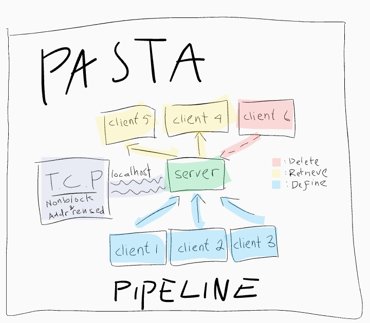

# Pasta, Key-Value pair text storage system

## Usage
Pasta provides 2 mode, **STDIN** and **TCP**. **STDIN** mode
use STDIN_FILENO file descriptor that modified to be
non-blocking using `fcntl` system call (that's why this program may not
compatible with Windows system), so that if the user doesn't yet provide an
input, the process doesn't busy wait on that task.

While **TCP** use the main process as a server that ran on
local address with the default port `3000`. Also the server
and it's client that get accepted is guaranteed to be non-blocking.
The average CPU usage on a single core (in my machine) is only 1.9,
which is quite low if i do say so myself.

## Command Line Interface
When entering a pasta prompt, you'd be greeted with a prompt `>>> `
or something you specify using `--prompt <PROMPT>`. Enter text like normally
you'd do on a terminal but end it with a `CTRL-d`. It has to do with the EOF,
which i can't tell if the data sended by clients is completed or not.

If the command is successfuly sended, the prompt will printed again, ready for
another use. The strange behaviour happen when you try to send a `SIGINT` signal / `CTRL-C`
to telnet, atleast that's what happen in my system so don't do that.

For your information, in telnet when you:
1. Send an EOF / `CTRL-D`, the server will recieve only 1 byte of data
2. Send normally, the server will recieve 2 whitespace at the end of a stream,
   which is `\r` (carriage return) and `\n` (newline) so the parser strips all of them.

## Stupid topology

I found out that using `--shared 1`, you can get a chatting-apps like behaviour, which is funny to me.
